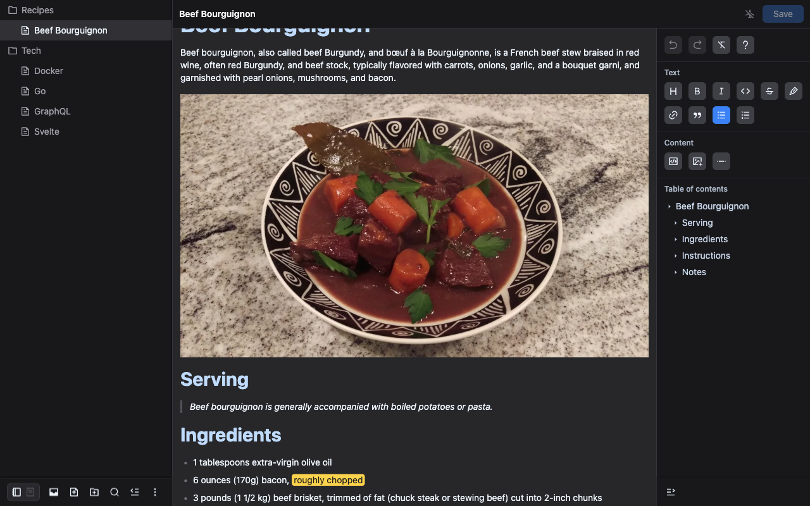
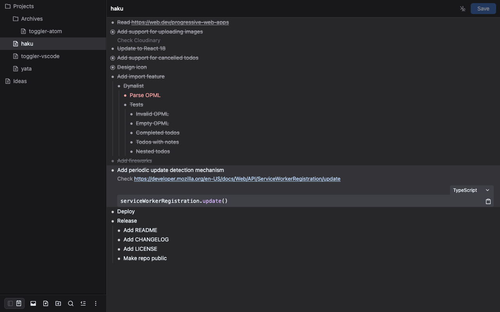
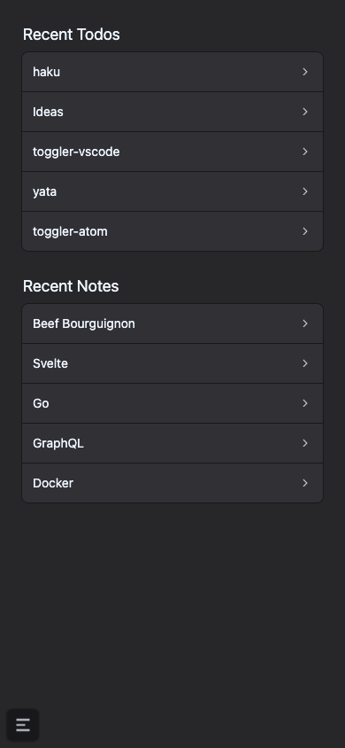
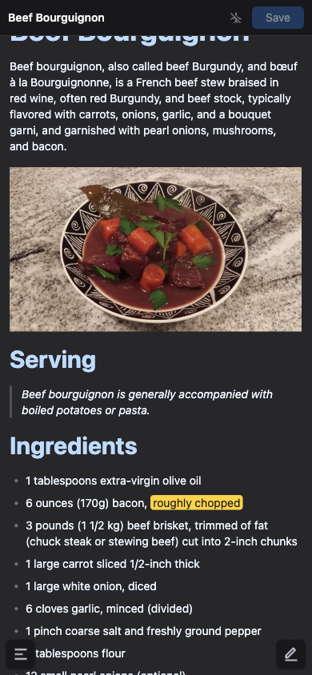
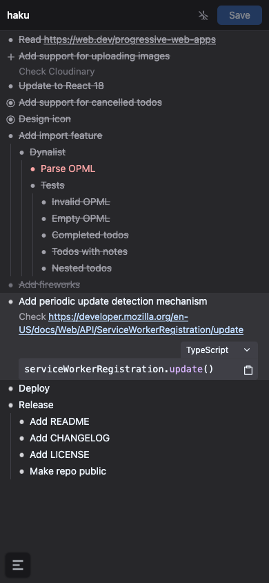

  
  <h1>Haku</h1>

  

    <strong>Craft, consolidate and tackle your notebooks and to-do lists all in one place…</strong>
  

  

    
    
  

  

    
    
    
  

   

    
    
  

## Motivations

I write lots of notes and to-do lists on a daily basis. I tested a lot of different services and applications over the years to accomplish this but I never managed to find a solution that fits all my needs.

My most recent setup was composed of [OneNote](https://www.onenote.com) for notes and [Dynalist](https://dynalist.io) for to-do lists but I was still not satisfied with the result for various reasons, the most important ones being the lack of Markdown syntax and code highlighting in OneNote combined with the fact that every other text copy would fail on macOS for no reason, and the absence of a web version of Dynalist to open a to-do list on any device while I was on the go.

Haku - _**to compose, invent, put in order, arrange in Hawaiian**_ - is a **very opinionated** web application to consolidate in one place all my notes and to-do lists. There are no date-related features because when I need to deal with appointments, reminders, etc. I just use a calendar.

The note taking part of the application is inspired by [OneNote](https://www.onenote.com) and [Obsidian](https://obsidian.md) while the to-do lists take inspiration from [Dynalist](https://dynalist.io) and [Todo+](https://marketplace.visualstudio.com/items?itemName=fabiospampinato.vscode-todo-plus).

## Features

- [Heavily keyboard-focused workflows](https://user-images.githubusercontent.com/494699/176217718-5186c05f-3070-4e2b-9a76-4b0bc39a0f14.png)
- [Available as a web application or Progressive Web App](https://user-images.githubusercontent.com/494699/176217779-04f3d91d-1119-4892-8a13-e7b010ce8733.png) that can be installed on desktop and mobile devices
- [Content-focused with hideable sidebars](https://user-images.githubusercontent.com/494699/176217983-be1843fc-1bf5-45a5-b97d-b62eb4c46a6b.png)
- [Full text search](https://user-images.githubusercontent.com/494699/176218046-5d783d33-8c2d-439c-880e-08ab2acf6fc0.png)
- [Quick method to share content to the application](https://user-images.githubusercontent.com/494699/176218124-64cb89c4-04f7-4064-a459-763236744d01.png) from any device [collected in an Inbox](https://user-images.githubusercontent.com/494699/176218406-05f6ae4e-f15f-43b4-887c-bd94cbb4b378.png)
- [Passwordless authentication](https://user-images.githubusercontent.com/494699/176218450-509fa235-60bf-4ec0-a544-c308f4cff3ad.png)
- [Offline support](https://user-images.githubusercontent.com/494699/176218506-eeb89e27-bc8e-4ab8-b195-756a3e6e43c9.png) (read-only at the moment)
- [Allow-list of authorized users](https://user-images.githubusercontent.com/494699/176218611-3b4a5cb8-0083-4e52-9cf6-63be4f3758d9.png)
- Notes:
  - [Markdown syntax](https://user-images.githubusercontent.com/494699/176218652-e1a15483-e8dd-434c-ae70-57e17445d6ef.png)
  - [Code highlighting](https://user-images.githubusercontent.com/494699/176218723-5ca80a78-3f63-4751-954e-2b2f82ded825.png)
  - [Quick image upload à la GitHub](https://user-images.githubusercontent.com/494699/176218788-8d6a80bd-64b5-4af4-b0cd-4cb73b26dcf9.png)
  - [Automatic table of contents](https://user-images.githubusercontent.com/494699/176218830-419afa6d-7226-42a9-97af-1e2f1ddf42b3.png)
- Todos:
  - [List of to-do items with infinite levels of nesting](https://user-images.githubusercontent.com/494699/176218999-a1d11b99-48ed-4235-9a28-297f04b7fe97.png)
  - [Seamless keyboard navigation between to-do items like in a text editor](https://user-images.githubusercontent.com/494699/176217495-2ddaf7d8-da4d-4d6c-b6f4-798771763939.mp4)
  - [To-do item are composed of a text description which can be complemented by a note supporting Markdown syntax](https://user-images.githubusercontent.com/494699/176219053-aaa0507d-004b-4c24-ab75-dd46cb4d4c7b.png)
  - [Every to-do items can be marked as completed or cancelled](https://user-images.githubusercontent.com/494699/176219125-a9de2afe-9282-4d39-a907-9e5bbe74a33e.png)
  - [Missed to-do items are highlighted](https://user-images.githubusercontent.com/494699/176219169-fe5f9a5c-a6ed-4925-98af-ed1d2812c0bf.png)
  - [Nested to-do items can be collapsed](https://user-images.githubusercontent.com/494699/176219202-a9d2f722-71bb-4052-b5eb-7ad9fc201059.png)

Haku is still in development as I plan to add more features when I get the time.

## Architecture

- [Next.js](https://nextjs.org/) for the React application and API routes (hosted on [Vercel](https://vercel.com) in production).
- [Postgres](https://www.postgresql.org) database accessed through [Prisma](https://www.prisma.io) (hosted on [Supabase](https://supabase.com) in production and development accessed through a [Data Proxy](https://www.prisma.io/data-platform/proxy) - a local Docker version is used during tests).
- [NextAuth.js](https://next-auth.js.org) for the authentication.
- [tRPC](https://trpc.io) for end-to-end typesafe APIs.
- [Cloudinary](https://cloudinary.com) for image uploads.
- [EmailJS](https://www.emailjs.com) for sending authentication emails.
- [Custom Apple Shortcut](https://support.apple.com/en-gb/guide/shortcuts/welcome/ios) to quickly share content to the application inbox (should be replaced by the native [Web Share Target API](https://w3c.github.io/web-share-target) once supported on more devices).

I am currently hosting a private instance of the application for my own use and don't plan to open it to the public at this time.

## License

Licensed under the MIT License, Copyright © HiDeoo.

See [LICENSE](https://github.com/HiDeoo/Haku/blob/main/LICENSE) for more information.
